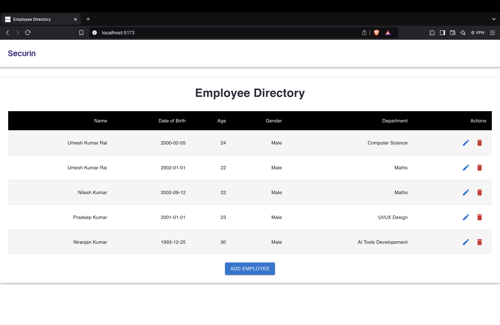
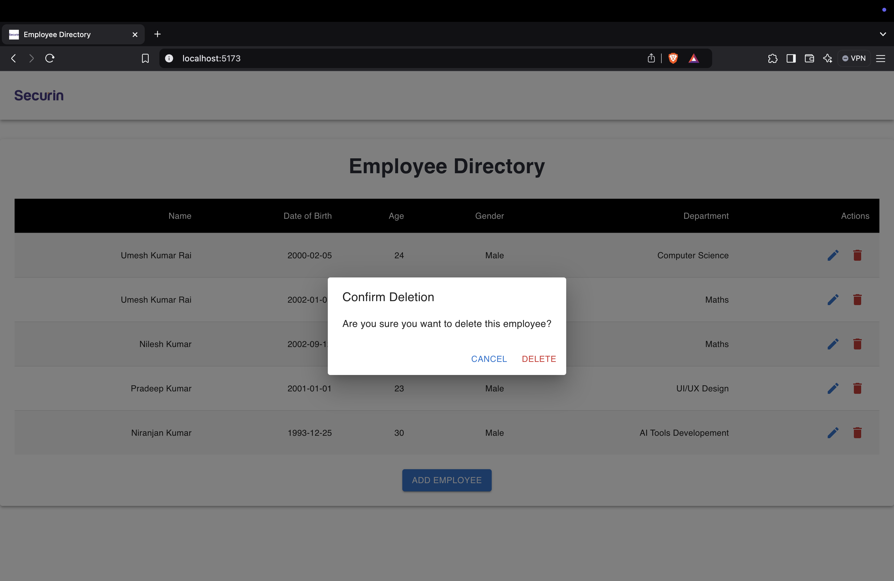
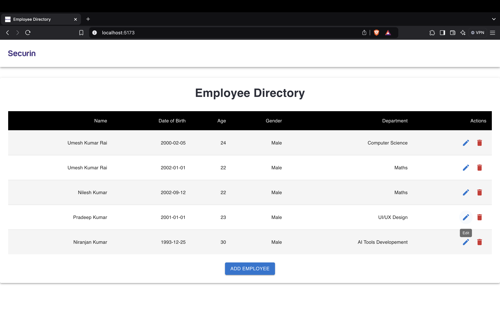

# Employee-directory

## Overview
The **Employee Directory** is a web application designed to manage employee information. It provides functionalities to add, edit, delete, and view employee details through a responsive and user-friendly interface.

## Screenshots

### Adding a New Employee


### Editing Employee Details


### Homepage


### Delete Dialogue Box


### Material UI icon and toolkit


This project uses:
- **Frontend**: React.js with Material-UI for styling.
- **Backend**: Python with Django REST Framework.
- **Database**: SQLite3 (default Django database).

---

## Features
- Add, edit, and delete employee records.
- Responsive design for desktop and mobile.
- Modular structure for frontend and backend.

---

## Prerequisites
Ensure the following are installed on your system:
1. **Node.js** (LTS version recommended).
2. **Python 3.9+**.
3. **Git** (for version control).

---

## Project Setup

### 1. Clone the Repository
```bash
git clone https://github.com/yourusername/employee-directory.git
cd employee-directory
```

### 2. Backend Setup
1. Navigate to the backend Folder
```bash
cd backend
```
2.	Create and activate a virtual environment
  ```bash
python -m venv venv
source venv/bin/activate    # macOS/Linux
venv\Scripts\activate       # Windows
```
3.	Install Python dependencies:
```bash
pip install -r requirements.txt
```
4.	Apply database migrations:
```bash
python manage.py makemigrations
python manage.py migrate
```
5.	Create a superuser for the Django admin panel:
```bash
python manage.py createsuperuser
```
6.Run the development server:
```bash
python manage.py runserver
```
The backend will run at http://localhost:8000.

### 3. Frontend Setup
1.	Install Node.js dependencies:
```bash
npm install
```
2. Start the development server:
```bash
npm run dev
```
The frontend will run at http://localhost:5173.

4. Running the Application

	1.	Ensure both the backend and frontend servers are running.
	2.	Open your browser and navigate to:
	•	Frontend: http://localhost:5173.
	•	Backend API: http://localhost:8000/api.
	•	Django Admin Panel: http://localhost:8000/admin (use superuser credentials).


## Developed by ~ **Umesh Kumar Rai**

